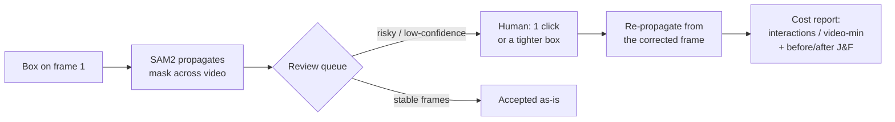

# MaskReview

**English** | [简体中文](README.zh-CN.md)

> Auto-label first, then send a human back **only** to the frames most likely to be wrong — and measure exactly how much human effort that took.

MaskReview is a **post-propagation review workbench** for SAM2 video segmentation. It is deliberately *not* another video annotation tool. It owns one link in the labeling chain: after SAM2 has propagated a first-frame mask across an entire video, **which frames are worth a human's time, and what did fixing them actually cost?**

<!-- TODO: drop a 60–90s demo GIF of the full loop here — it is the single cheapest thing that makes this README land. -->
*(Demo GIF goes here: box on frame 1 → propagate → queue surfaces drift frames → one correction → J&F jumps.)*

---

## What it does



1. You draw one box on the first frame.
2. SAM2 propagates the mask across the whole clip.
3. MaskReview surfaces **only** the suspicious frames into a ranked `review_queue` (empty mask, area jump/decline, center jump, edge contact, frame-to-frame IoU drop, low SAM2 confidence, over-segmentation).
4. You make a **minimal** correction on each flagged frame — one positive/negative point, or a tighter box.
5. It re-propagates from the corrected frame and reports the human cost (`interactions_per_video_minute`) and the mask-quality change (before/after J&F).

## Why it's different (honestly)

Plenty of platforms (CVAT, Roboflow, Labelbox, Encord, V7, …) already do SAM2 propagation **and** have review/issue systems. The part MaskReview adds that those don't surface as a product is the **cost-accounting layer**:

> *"Out of 388 frames I flagged 8, ranked by risk; the 54 disappeared frames collapse into 1 interaction instead of being billed per-frame; estimated ~12 clicks vs 39 for fixed-interval review (**−69%**); after the fix J&F went 0.79 → **0.92**."*

That framing — treating human-in-the-loop review as a measurable budget line tied to quality recovered — is the differentiator, plus a single ranked `review_score` with occlusion damping so a target leaving frame doesn't inflate the cost. It is a clean idea and a strong engineering artifact; it is **not** a moat. See [Limitations](#limitations) for what is and isn't validated.

---

## Quickstart — local Gradio demo

Linux + CUDA + Python 3.10+ recommended. SAM2 requires PyTorch/TorchVision installed first.

```bash
pip install torch torchvision --index-url https://download.pytorch.org/whl/cu124
pip install -r requirements.txt
python scripts/download_sam2_checkpoint.py --model tiny
python src/app.py --share --sam2-checkpoint checkpoints/sam2.1_hiera_tiny.pt
```

Then in the browser:

1. Upload a short video.
2. Enter the first-frame target box as `x1,y1,x2,y2`.
3. SAM2 generates and propagates the mask.
4. You get an overlay video, per-frame masks, the low-confidence frame queue, and the review-cost metrics.

You can **click directly on the source frame** to drop correction points (multi-click = multi-point); in tight-box mode, two clicks define the box. Clicks auto-fill the (still-editable) coordinate fields.

### CLI flags

| Flag | Meaning |
| --- | --- |
| `--share` | Create a public Gradio link. |
| `--sam2-checkpoint` | Path to the SAM2 checkpoint. |
| `--sam2-model-cfg` | SAM2 config (default `configs/sam2.1/sam2.1_hiera_t.yaml`). |
| `--device` | Default `cuda`. |
| `--vos-optimized` | Enable SAM2's video optimization. |

### What comes out

```text
outputs/<run_id>/
  frames/  masks/  overlay.mp4
  review_queue.json      # the frames worth a human's time, ranked by review_score
  metrics.json           # interaction estimates, reason counts, per-frame confidence
  corrections.json       # one saved correction per reviewed frame
  masks_after/  overlay_after.mp4
  review_queue_after.json  metrics_after.json
  comparison.json        # before/after queue size, interactions, mask area
```

Each `review_queue.json` item carries `frame_index`, `reason`/`reasons`, `frame_path`, `mask_path`, `recommended_correction`, `estimated_interactions`, a unified `review_score` (0–1, for ranking), `status` (`needs_review` or `low_confidence_empty`), and `diagnostics.confidence` (that frame's SAM2 confidence).

### Review signals

| Signal | Fires when |
| --- | --- |
| `empty_mask` | the mask vanished on a frame |
| `mask_area_dropped` / `spiked` / `trending_down` | sudden or sustained area change |
| `mask_center_jumped` | the mask centroid teleported |
| `mask_touches_frame_edge` | the mask runs into the frame border |
| `mask_iou_dropped` | low frame-to-frame mask IoU |
| `low_mask_confidence` | SAM2 itself is unsure (confidence < threshold) |
| `mask_oversized` | over-segmentation — the mask blew up to cover too much |

Geometry catches *"SAM2 is confident but tracking the wrong look-alike"*; confidence catches *"the target is lost / absent"* (disappeared frames score ≈0). A long disappearance is collapsed into a **single** onset interaction so it doesn't inflate the cost estimate (measured 54 → 5 on one disappear/reappear clip).

---

## Evaluation harness

Batch evaluation is manifest-driven. Put real clips in `data/eval_videos/`, generate a template, fill in the boxes, and run:

```bash
# 1. scaffold a manifest (exports each clip's first frame for you to read the box off)
python scripts/generate_eval_manifest_template.py \
  --video-dir data/eval_videos \
  --output data/eval_manifest.template.json \
  --first-frame-dir data/eval_first_frames --overwrite

# 2. fill init_box_xyxy / object_name / expected_review_frames, save as data/eval_manifest.json, then:
python scripts/run_evaluation.py data/eval_manifest.json \
  --output-dir outputs/evaluation \
  --fixed-interval 10 \
  --sam2-checkpoint checkpoints/sam2.1_hiera_tiny.pt
```

It writes `evaluation_results.csv` + `evaluation_report.md`, putting the MaskReview queue and a **fixed-interval baseline** on the same row (`queue_estimated_interactions` vs `saved_interactions_vs_fixed_interval`). If you label `expected_review_frames`, it also reports queue precision/recall/F1 and missed/false-positive counts. Pass `--calibrate` to sweep sensitive/default/conservative thresholds at once.

**Ground-truth quality (J/F/J&F).** Add a `ground_truth_mask_dir` to a manifest case (a folder of `000000.png`, `000001.png`, … masks) and the harness scores propagation with DAVIS-style region IoU (J), boundary F, and J&F — before and after corrections — proving a fix *recovered mask quality*, not just shortened the queue.

---

## CVAT plugin

The flagship: run the whole loop against a real self-hosted [CVAT](https://github.com/cvat-ai/cvat) (Docker), so the masks land in an actual annotation platform and the risky frames become CVAT **issues** a human resolves.

**Prerequisites:** a self-hosted CVAT; a task whose frame 0 has a **seed rectangle** drawn and saved; `pip install cvat-sdk`. Credentials come from the environment — never hard-coded:

```bash
export CVAT_HOST=http://localhost:8080   # default
export CVAT_USER=...   CVAT_PASSWORD=...
```

```bash
# pull frames + seed box -> run SAM2 -> import masks -> raise one issue per risky frame
python scripts/cvat_sync.py push --task-id <id>

# ... annotator fixes the flagged frames in CVAT and resolves the issues ...

# compare the review estimate against issues actually resolved
python scripts/cvat_sync.py stats --task-id <id>

# download the human-corrected annotations
python scripts/cvat_sync.py export --task-id <id> --out corrected.zip
```

`push` options: `--seed-frame N` (which frame holds the seed box), `--label NAME`, `--min-score 0.4` (drop damped/collapsed frames below this `review_score` from issues), `--via {coco,shapes}` (import masks as a COCO dataset, or as **native editable CVAT mask shapes**), `--device cuda`. `stats` reports estimated interactions vs issues resolved and a `review_coverage` ratio. Full design notes: [docs/cvat_plugin.md](docs/cvat_plugin.md).

---

## Results (first ground-truth pass)

SAM2.1 hiera **tiny**, RTX 3060 (~0.35–0.5 s/frame). J&F = mean of region IoU (J) and boundary F against per-frame ground truth.

| Dataset | Sequences | Mean baseline J&F | Queue behavior |
| --- | ---: | ---: | --- |
| DAVIS-2017 (single-object) | 5 | **0.96** | near-silent; a few geometric false positives, 0 misses |
| MOSE (crowded / occlusion / look-alikes) | 15 | **0.88** | active on real drift; over-fires on disappear/reappear |

Correcting a real drift frame with one ground-truth box and re-propagating recovers quality — e.g. `23b9a3ea` (14-object crowd) **0.79 → 0.92** (+0.137), `398d41f5` (bird flock) 0.59 → 0.68. Honest caveat: correction boxes here are **auto-derived from ground truth** to demonstrate *"if given the right box, how much recovers"* — not a measured human cost yet.

---

## Limitations

- **The headline cost number isn't validated on real humans yet.** `interactions_per_video_minute` is currently simulated from ground-truth-derived correction boxes. A real human-cost study is the highest-leverage next step.
- **Tiny model only.** Results use `sam2.1_hiera_tiny`; larger variants are untested.
- **The geometric queue over-fires on disappear/reappear** (a known MOSE failure mode); the SAM2-confidence signal and absence-run collapse mitigate but don't fully solve it.
- **No moat.** The drift signals are standard heuristics any platform can replicate; the value here is the framing, the evaluation rigor, and the end-to-end CVAT integration.

---

## Project structure

```text
maskreview/
  README.md  README.zh-CN.md  CHANGELOG.md  PLAN_TRACKER.md  requirements.txt
  docs/
    research_plan.md        # scope & MVP plan
    cvat_plugin.md          # CVAT plugin design
    landing_readiness.md
  src/
    app.py                  # Gradio UI + click-to-correct
    pipeline.py             # review queue construction, review_score, ReviewPolicy
    sam2_runner.py          # SAM2 propagation + correction re-propagation
    corrections.py          # correction schema / parsing
    quality_metrics.py      # J / F / J&F scoring
    evaluation.py  manifest_template.py  video_io.py
    cvat/
      export.py             # offline: masks->COCO RLE, queue->issues, interaction_report
      client.py             # live cvat-sdk bridge (pull / import / issues / export)
  scripts/
    download_sam2_checkpoint.py  run_evaluation.py
    generate_eval_manifest_template.py  cvat_sync.py  prepare_sample_video.py
  tests/                    # unittest suite
```

Run the tests with `python -m unittest discover -s tests`.

## Requirements & license

Python 3.10+, a CUDA GPU (validated on an RTX 3060), and the deps in `requirements.txt` (SAM2, Gradio, OpenCV, NumPy; `cvat-sdk` only for the plugin). The software stack is permissively licensed (SAM2 code + `sam2.1-hiera-tiny` weights Apache-2.0, CVAT + cvat-sdk MIT, Gradio Apache-2.0). **Datasets are research-only:** MOSE is CC BY-NC-SA 4.0 (non-commercial) and DAVIS-2017 is restricted — keep their benchmark results out of any commercial/shipped path.
