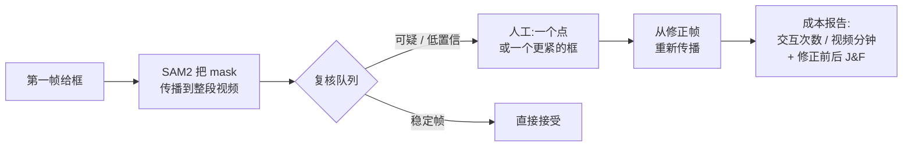

# MaskReview

[English](README.md) | **简体中文**

> 先自动标完,只把**最可能错的帧**交还给人复核 —— 并精确计量这趟人工花了多少。

MaskReview 是一个面向 SAM2 视频分割的**传播后复核工作台**。它刻意**不是**又一个视频标注工具,只做标注链条里的一环:SAM2 把第一帧的 mask 传播到整段视频之后,**哪些帧值得叫人回来修,修这些帧到底花了多少人工?**

<!-- TODO: 在这里放一段 60–90 秒的完整流程 demo GIF —— 这是让 README 立刻"立住"最便宜的一招。 -->
*(demo GIF 放这里:第一帧给框 → 传播 → 队列挑出漂移帧 → 一次修正 → J&F 回升。)*

---

## 它做什么



1. 你在第一帧画一个框。
2. SAM2 把 mask 传播到整段视频。
3. MaskReview **只**把可疑帧放进排好序的 `review_queue`(空 mask、面积突变/连降、中心跳变、贴边、帧间 IoU 下跌、SAM2 低置信、过度分割)。
4. 你对每个被挑出的帧做**最小**修正 —— 一个正/负点,或一个更紧的框。
5. 它从修正帧重新传播,并报告人工成本(`interactions_per_video_minute`)和 mask 质量变化(修正前后 J&F)。

## 差异化在哪(说实话)

很多平台(CVAT、Roboflow、Labelbox、Encord、V7……)早就既有 SAM2 传播、**也有**复核/issue 系统。MaskReview 多出来、而它们没有把它做成产品的那一层,是**成本会计层**:

> *"388 帧里我挑出 8 帧,按风险排序;消失的那 54 帧合并成 1 次交互,而不是逐帧计费;预计约 12 次点击 vs 固定间隔复核的 39 次(**−69%**);修完 J&F 从 0.79 → **0.92**。"*

这个 framing —— 把 human-in-the-loop 复核当成一个可计量、并和质量回升挂钩的预算项 —— 才是差异点;再加上一个带遮挡阻尼的统一 `review_score`,让目标离场不会把成本撑大。这是个干净的点子和很强的工程作品,但**不是护城河**。哪些被验证了、哪些还没,见[局限](#局限)。

---

## 快速上手 —— 本地 Gradio demo

建议 Linux + CUDA + Python 3.10+。SAM2 要求先装好 PyTorch/TorchVision。

```bash
pip install torch torchvision --index-url https://download.pytorch.org/whl/cu124
pip install -r requirements.txt
python scripts/download_sam2_checkpoint.py --model tiny
python src/app.py --share --sam2-checkpoint checkpoints/sam2.1_hiera_tiny.pt
```

然后在浏览器里:

1. 上传一段短视频。
2. 输入第一帧目标框,格式 `x1,y1,x2,y2`。
3. SAM2 生成并传播 mask。
4. 你会得到 overlay 视频、逐帧 mask、低置信帧队列,以及复核成本指标。

可以**直接点中心帧**来下修正点(多点连点);Tight box 模式点两个对角即可定框。点击会自动填入下方坐标框(仍可手改)。

### 命令行参数

| 参数 | 含义 |
| --- | --- |
| `--share` | 创建 Gradio 公网链接。 |
| `--sam2-checkpoint` | SAM2 checkpoint 路径。 |
| `--sam2-model-cfg` | SAM2 config(默认 `configs/sam2.1/sam2.1_hiera_t.yaml`)。 |
| `--device` | 默认 `cuda`。 |
| `--vos-optimized` | 启用 SAM2 的视频优化。 |

### 输出

```text
outputs/<run_id>/
  frames/  masks/  overlay.mp4
  review_queue.json      # 值得人工复核的帧,按 review_score 排序
  metrics.json           # 交互估计、原因计数、逐帧置信度
  corrections.json       # 每个复核帧保存一条修正
  masks_after/  overlay_after.mp4
  review_queue_after.json  metrics_after.json
  comparison.json        # 修正前后的队列数、交互次数、mask 面积
```

`review_queue.json` 的每一项包含 `frame_index`、`reason`/`reasons`、`frame_path`、`mask_path`、`recommended_correction`、`estimated_interactions`、统一的 `review_score`(0–1,用于排序)、`status`(`needs_review` 或 `low_confidence_empty`)、以及 `diagnostics.confidence`(该帧 SAM2 置信度)。

### 复核信号

| 信号 | 触发条件 |
| --- | --- |
| `empty_mask` | 某帧 mask 消失 |
| `mask_area_dropped` / `spiked` / `trending_down` | 面积突变或持续下降 |
| `mask_center_jumped` | mask 质心瞬移 |
| `mask_touches_frame_edge` | mask 撞到画面边界 |
| `mask_iou_dropped` | 帧间 mask IoU 偏低 |
| `low_mask_confidence` | SAM2 自身不确定(置信度低于阈值) |
| `mask_oversized` | 过度分割 —— mask 膨胀到覆盖过大区域 |

几何信号抓"SAM2 很自信但跟错了相似目标";置信度抓"目标丢失/不在场"(消失帧置信度≈0)。一长段消失会被合并成**一次** onset 交互,不撑大成本估计(某段消失/重现视频实测 54 → 5)。

---

## 评估工具(Evaluation harness)

批量评估由 manifest 驱动。把真实短视频放进 `data/eval_videos/`,生成模板、补齐框,然后跑:

```bash
# 1. 生成 manifest 模板(顺便导出每段视频的第一帧,方便你读框)
python scripts/generate_eval_manifest_template.py \
  --video-dir data/eval_videos \
  --output data/eval_manifest.template.json \
  --first-frame-dir data/eval_first_frames --overwrite

# 2. 补齐 init_box_xyxy / object_name / expected_review_frames,存为 data/eval_manifest.json,再跑:
python scripts/run_evaluation.py data/eval_manifest.json \
  --output-dir outputs/evaluation \
  --fixed-interval 10 \
  --sam2-checkpoint checkpoints/sam2.1_hiera_tiny.pt
```

它会写出 `evaluation_results.csv` + `evaluation_report.md`,把 MaskReview 队列和**固定间隔 baseline** 放在同一行对比(`queue_estimated_interactions` vs `saved_interactions_vs_fixed_interval`)。如果标了 `expected_review_frames`,还会输出队列的 precision/recall/F1 和漏检/误报数。加 `--calibrate` 可一次跑 sensitive/default/conservative 三档阈值。

**真值质量(J/F/J&F)。** 给某个 case 加一个 `ground_truth_mask_dir`(存放 `000000.png`、`000001.png`… 的目录),评估时就会用 DAVIS 口径的 region IoU(J)、boundary F 和 J&F 给传播结果打分 —— 修正前后都打,证明一次修正是真的**修回了 mask 质量**,而不只是让队列变短。

---

## CVAT 插件

旗舰功能:把整套闭环跑在真实的自建 [CVAT](https://github.com/cvat-ai/cvat)(Docker)上,让 mask 落进真正的标注平台,可疑帧变成 CVAT **issue** 由人去解决。

**前置条件:** 一个自建 CVAT;某个 task 的第 0 帧已画好并保存了**种子框**;`pip install cvat-sdk`。凭据从环境变量读取,绝不硬编码:

```bash
export CVAT_HOST=http://localhost:8080   # 默认
export CVAT_USER=...   CVAT_PASSWORD=...
```

```bash
# 拉帧+种子框 -> 跑 SAM2 -> 导入 mask -> 每个风险帧建一个 issue
python scripts/cvat_sync.py push --task-id <id>

# ……标注员在 CVAT 里修被挑出的帧、解决 issue……

# 把复核估计 与 实际解决的 issue 做对比
python scripts/cvat_sync.py stats --task-id <id>

# 下载人工修正后的标注
python scripts/cvat_sync.py export --task-id <id> --out corrected.zip
```

`push` 可选项:`--seed-frame N`(种子框在第几帧)、`--label NAME`、`--min-score 0.4`(低于此 `review_score` 的被阻尼/合并帧不建 issue)、`--via {coco,shapes}`(把 mask 作为 COCO 数据集导入,或作为**可直接编辑的 CVAT 原生 mask 形状**导入)、`--device cuda`。`stats` 输出估计交互数 vs 已解决 issue 数,以及一个 `review_coverage` 比值。完整设计文档:[docs/cvat_plugin.md](docs/cvat_plugin.md)。

---

## 实验结果(首批真值评测)

SAM2.1 hiera **tiny**,RTX 3060(约 0.35–0.5 秒/帧)。J&F = region IoU(J)与 boundary F 的均值,对逐帧真值 mask 计算。

| 数据集 | 序列数 | 平均 baseline J&F | 队列行为 |
| --- | ---: | ---: | --- |
| DAVIS-2017(单目标) | 5 | **0.96** | 几乎全程沉默;零星几何误报,0 漏检 |
| MOSE(拥挤/遮挡/相似目标) | 15 | **0.88** | 在真漂移上活跃;在消失/重现上误报 |

在真漂移帧用一个真值框做修正并重传播即可回升质量 —— 如 `23b9a3ea`(14 目标拥挤)**0.79 → 0.92**(+0.137)、`398d41f5`(鸽群)0.59 → 0.68。诚实说明:这里的修正框是**从真值自动推出来的**,用于演示"若给出正确框能恢复多少",还不是真实人工成本。

---

## 局限

- **核心成本数字还没在真人身上验证。** `interactions_per_video_minute` 目前是用真值推出的修正框模拟的。做一个真人成本实验是杠杆最高的下一步。
- **只测了 tiny 模型。** 结果用的是 `sam2.1_hiera_tiny`,更大的变体未测。
- **几何队列在消失/重现时误报**(已知的 MOSE 失败模式);SAM2 置信度信号和消失段合并能缓解但没完全解决。
- **没有护城河。** 这些漂移信号是任何平台都能复刻的标准启发式;价值在于 framing、评估严谨度,以及端到端的 CVAT 集成。

---

## 项目结构

```text
maskreview/
  README.md  README.zh-CN.md  CHANGELOG.md  PLAN_TRACKER.md  requirements.txt
  docs/
    research_plan.md        # 范围与 MVP 计划
    cvat_plugin.md          # CVAT 插件设计
    landing_readiness.md
  src/
    app.py                  # Gradio UI + 点击修正
    pipeline.py             # 复核队列构建、review_score、ReviewPolicy
    sam2_runner.py          # SAM2 传播 + 修正重传播
    corrections.py          # 修正 schema / 解析
    quality_metrics.py      # J / F / J&F 评分
    evaluation.py  manifest_template.py  video_io.py
    cvat/
      export.py             # 离线:mask->COCO RLE、queue->issues、interaction_report
      client.py             # 实时 cvat-sdk 桥接(拉取 / 导入 / issue / 导出)
  scripts/
    download_sam2_checkpoint.py  run_evaluation.py
    generate_eval_manifest_template.py  cvat_sync.py  prepare_sample_video.py
  tests/                    # unittest 测试套件
```

跑测试:`python -m unittest discover -s tests`。

## 环境与许可证

Python 3.10+、一块 CUDA GPU(在 RTX 3060 上验证),以及 `requirements.txt` 里的依赖(SAM2、Gradio、OpenCV、NumPy;`cvat-sdk` 仅插件需要)。软件栈均为宽松许可(SAM2 代码 + `sam2.1-hiera-tiny` 权重 Apache-2.0,CVAT + cvat-sdk MIT,Gradio Apache-2.0)。**数据集仅限研究用途:** MOSE 是 CC BY-NC-SA 4.0(非商用),DAVIS-2017 受限 —— 它们的基准结果不要放进任何商业/上线路径。
